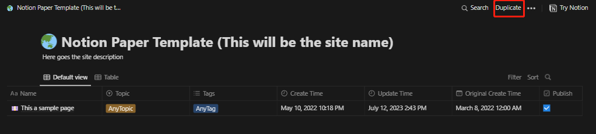
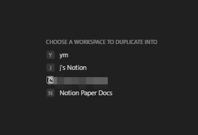
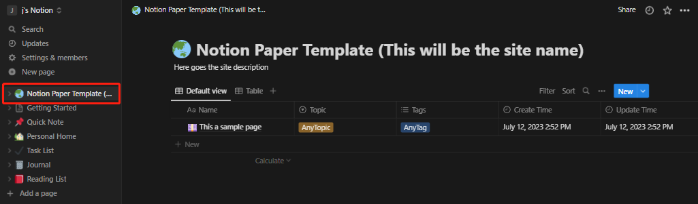
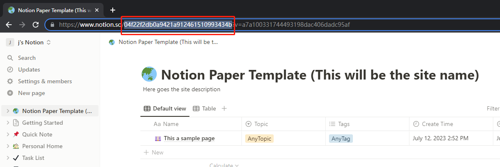

import { Steps } from "@astrojs/starlight/components";

Firstly, you need to create a database in your Notion to store and manage your posts.

<Steps>

1. Visit [this link](https://notion.so/dc5b49137cc0426a9b3ebfe4cc7f24a5?v=025e15f88d8847f987e370eb94346a9a) and click the "`Duplicate`" button on the top right corner:

2. Choose any workspace at your wish to save this template. 

3. Now you can see this database you just saved.

4. Copy the string from the URL shown in the red box, where located between `notion.so` and `?v=`. 

</Steps>
