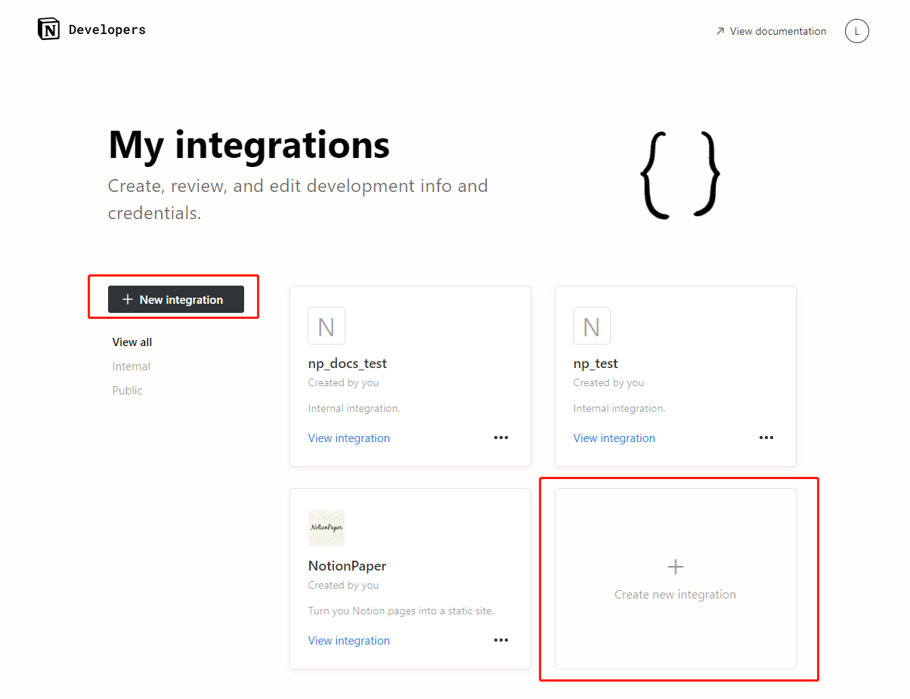
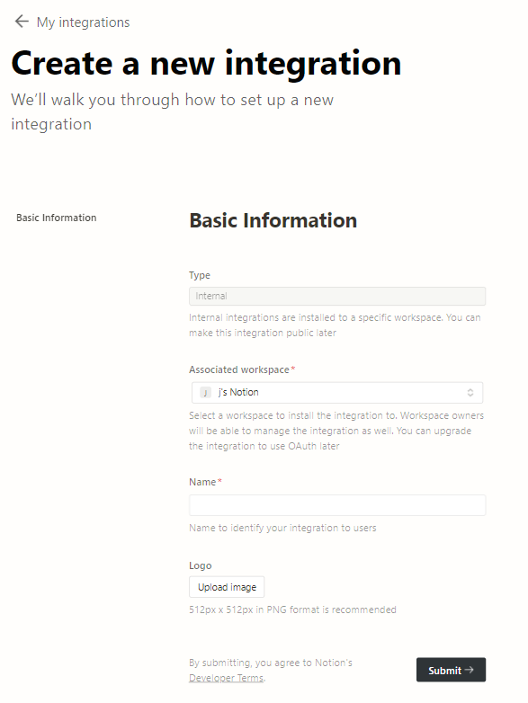
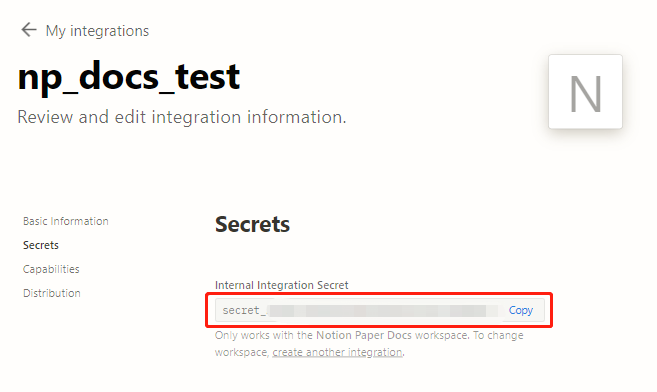

import { Steps } from "@astrojs/starlight/components";

Then you'll need a API token to access your contents.

<Steps>

1. Go to https://www.notion.so/my-integrations and click any of the "`Create new integration`" button on the page:

2. On this page, you could:

   - keep `Type` and `Logo` as it is.
   - `Associated Workspace` as the one you saved the template from Step 1 before.
   - `Name` as you like.

   

3. Click on `Submit` and save the `Internal Integration Secret` into somewhere safe! 

</Steps>
