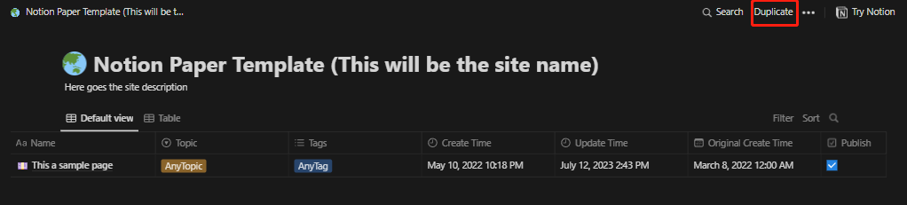
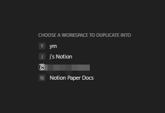
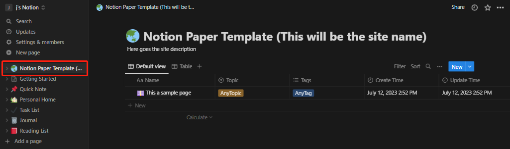
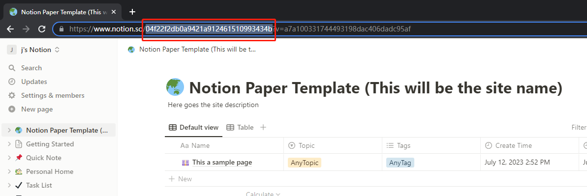

import { Steps } from "@astrojs/starlight/components";

首先，需要在 Notion 中创建一个数据库来存储和管理内容。

<Steps>

1. 打开 [这个模板](https://notion.so/dc5b49137cc0426a9b3ebfe4cc7f24a5?v=025e15f88d8847f987e370eb94346a9a) 点击右上角的 "`Duplicate`":

2. 选择任意一个你自己的 Workspace 来存储这个模板数据库。 

3. 完成后你就能看到这个数据库了。

4. 在浏览器的地址栏中，这串地址中的红框处文字即是数据库 ID (DATABASE_ID)，即地址中`notion.so/` 和 `?v=` 之间的字符串。保存起来，后面会用到。 

</Steps>
