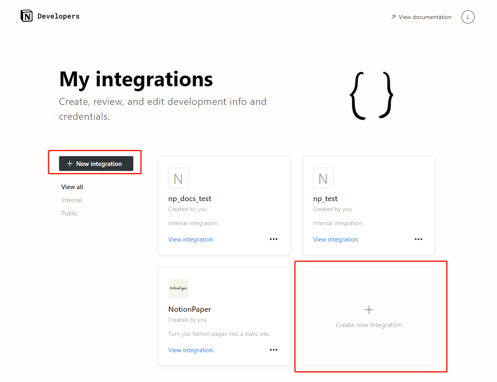
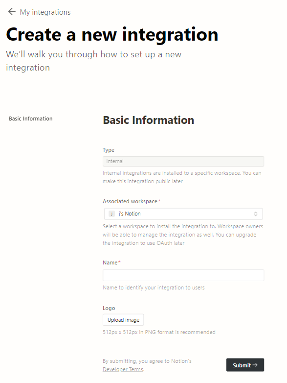
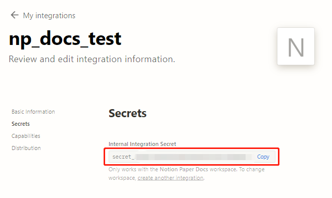

import { Steps } from "@astrojs/starlight/components";

然后申请一个 API Token 来访问内容。

<Steps>

1. 到 https://www.notion.so/my-integrations 点击任意一处的 `create new integration`:

2. 在这里:

   - `Type`和`Logo`可以不用动
   - `Associated Workspace` 选择你存放数据库的 Workspace
   - `Name` 中取一个名字

   

3. 点击`Submit` 后，保存`Internal Integration Secret`到一个安全的地方 

</Steps>
